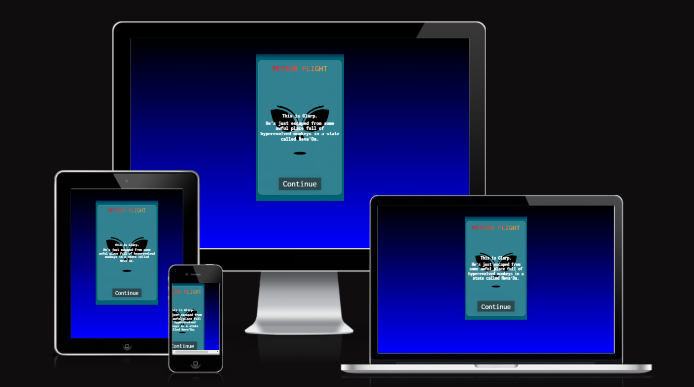

# Meteor Flight

Meteor Flight is an arcade style game where you control an alien vessel piloted by Glarp, trying to get home after escaping from Area 51. In your way stand 5 waves of meteor showers, which you have to survive to get to your home, Neva'Da (no relation to the place Glarp just escaped from).

The website allows the user to play the game, either using the keyboard or on-screen arrows. If the user survives all 5 waves, they are treated to a short animation of Glarp arriving on Neva'Da and a win screen.

Visit the deployed website [here](https://dajanplackovic.github.io/space-invaders/).

## Table of Contents

- [User Experience (UX)](#user-experience-ux)
  - [Project Goals](#project-goals)
  - [User Stories](#user-stories)
  - [Color Scheme](#color-scheme)
  - [Typography](#typography)
- [Features](#features)
  - [Main Content](#main-content)
    - [Game Area](#game-area)
    - [Controls](#controls)
  - [404 Page](#404-page)
- [Technologies Used](#technologies-used)
  - [Languages Used](#languages-used)
  - [Frameworks, Libraries and Programs Used](#frameworks-libraries-and-programs-used)
- [Testing](#testing)
  - [Testing User Stories](#testing-user-stories)
  - [Accessibility and SEO](#accessibility-and-seo)
  - [Tools Testing](#tools-testing)
  - [Manual Testing](#manual-testing)
    - [Browser Compatibility](#browser-compatibility)
    - [Device compatibility](#device-compatibility)
    - [Tests Performed](#tests-performed)
- [Deployment](#deployment)
  - [GitHub Pages](#github-pages)
- [Credits](#credits)
  - [Media](#media)
  - [Code](#code)
  - [Other](#other)
- [Acknowledgements](#acknowledgements)

---

## User Experience (UX)

### Project Goals

- The website is easy to navigate and the game is intuitive to play.

- The design is uniform and legible.

- The page adapts to different screen sizes.

### User Stories

- As a player, I want the game's website to be easy to navigate.

- As a player, I want the game to be fun and engaging.

- As a player, I want the game controls to be easy to access during the game.

- As a player, I want to receive overall feedback during and after the game.

- As a player, I want to be able to play the game on different devices.

### Color Scheme

       

The following colors were used on the site:

- Pure white ( `#ffffff`) and pure black ( `#000000`) were used as a basis to generate the glass effects for messages and buttons.
- Shades of yellow ( `ffcb43`), orange ( `#ff6425`) and red ( `#ff0016`) were used to generate the gradient used for the title and the meteor colors.
- Shades of dark blue ( `#020024`), deep blue ( `#090979`) and teal ( `#016478`) were used for the background and the game area to evoke space.

### Typography

All text on the site uses the [Inconsolata](https://fonts.google.com/specimen/Inconsolata) font.

## Features

### Main Content

#### Game Area

- The game area contains the ship, the intro menu, the meteors, displays messages and plays the ending animation.

- Initially an intro text explaining the story is shown.
  

- At the end of the intro, the user is given instructions how to play and the on-screen controls appear. The user can also use the arrow keys or the A and D keys to steer the ship.
  

- A message appears indicating when user is moving on to the next level.
  

- Each level, meteors are randomly generated. They get faster and more numerous each level. If the ship is hit by one, the meteor is replaced with an explosion and a loss message is shown indicating how far the user got
  

- If the user makes it all the way to the end, a short animation plays showing the ship arriving at Neva'Da.
  

- A message congratulating the player is shown and he is offered to play again.
  

- The game requires at least 500px of vertical space. If the user turns his phone to landscape mode while the game is open, he is told to switch to portrait mode and the game is paused. It is restarted once he switches back to portrait mode.
  

#### Controls

- The controls consist of two buttons with arrows

- They are displayed under the game area on most screens and to the right of the game area on smaller screens, where they do not fit below due to the minimum height of the game area.

### 404 Page

- The page is shown in case an invalid URL is entered. It contains a link to the homepage.

[Back to top ⇧](#meteor-flight)

## Technologies Used

### Languages Used

- [HTML5](https://en.wikipedia.org/wiki/HTML5)
- [CSS3](https://en.wikipedia.org/wiki/CSS)
- [Javascript](https://en.wikipedia.org/wiki/JavaScript)

### Frameworks, Libraries and Programs Used

- [Google Fonts](https://fonts.google.com/) was used to import Inconsolata.

- [Font Awesome](https://fontawesome.com/) was used for most graphics, such as the meteors, the rocket and the planet at the end.

- [GitHub](https://github.com/) was used to push the code to and the project was deployed using GitHub pages.

- [Am I Responsive?](http://ami.responsivedesign.is/#) was used to generate the mockup for the README.

- [css.glass](https://css.glass/) was used to generate the glass effect used for the intro, messages and buttons.

- [The colordesigner.io Gradient Generator](https://colordesigner.io/gradient-generator) was used to generate the colors for meteors in the different rounds.

- [gauger.io](https://gauger.io/fonticon/) was used to generate a favicon from a FontAwesome icon.

- [Chrome DevTools](https://developer.chrome.com/docs/devtools/) was used to troubleshoot errors, as well es to check the page for performance, accessibility and SEO issues.

- [W3C Markup Validator](https://validator.w3.org/) was used to validate the HTML code.

- [W3C CSS Validator](https://jigsaw.w3.org/css-validator/) was used to validate the CSS code.

- [JSHint](https://jshint.com/) was used to validate the JavaScript code.

[Back to top ⇧](#meteor-flight)

## Testing

### Testing User Stories

- As a player, I want the game's website to be easy to navigate.

  - The website consists of a single page.
  - The next steps are obvious and indicated with clearly labelled buttons.
  - How to play the game is explained in a succinct, but clear set of instructions.

- As a player, I want the game to be fun and engaging.

  - The game is increasingly challenging and fun to play.

- As a player, I want the game controls to be easy to access during the game.

  - The game can be played using the keyboard with ergonomic keys that align with controls for most games.
  - The on-screen arrows are responsive and easy to tap on a touchscreen.

- As a player, I want to receive overall feedback during and after the game.

  - Both messages and animation clearly indicate when the user is hit.
  - Victory is shown immediately with an animation and a message.

- As a player, I want to be able to play the game on different devices.

  - The game adapts to any device with more than 500px of vertical space.
  - On screens with less space, a message is shown indicating that the user should switch to portrait if on mobile.

  ### Code Validation

- The [W3C Markup Validation Service](https://validator.w3.org/) was used to validate the HTML code. [No errors were found.](https://validator.w3.org/nu/?doc=https%3A%2F%2Fdajanplackovic.github.io%2Fspace-invaders%2F)

- The [W3C CSS Validation Service - Jigsaw](https://jigsaw.w3.org/css-validator/) was used to validate the CSS. [No errors were found.](https://jigsaw.w3.org/css-validator/validator?uri=https%3A%2F%2Fdajanplackovic.github.io%2Fspace-invaders%2F&profile=css3svg&usermedium=all&warning=1&vextwarning=&lang=en)

  - There are warnings about vendor specific properties. These were added for compatibility as fallbacks and non-vendor-specific equivalents are used as well.

  - There is a warning for `text` being a deprecated value for `background-clip`. I was unable to find a replacement and I saw no rendering issues in any of the browsers I tested, so I did not address this.

- The [JSHints JavaScript Code Quality Tool](https://jshint.com/) was used validate the site's JavaScript code. Initially several hundred warnings were flagged, but all have since been resolved.
  

  - I did not use semicolons, as this was the setting in my code formatter. I changed the setting and added them where appropriate on save.

  - I forgot to initialize the iterator in several `for of` loops. I added `const` to each instance to resolve this.

  - I used the exponentiation operator `**`, which is supported as of ES7, but not in ES6. To ensure compatibility, I replaced it with `Math.pow()`

  - I used the object spread operator, which is only supported as of ES9. I replaced all instances with `Object.assign()`

  - I used the optional chaining syntax `?.`, which is only supported as of ES11. I replaced this with a more verbose `if (homeworld[0]) {homeworld[0].remove()}` for compatibility.

  - I invoked an external function and an external object inside of an anonymous function inside a for loop, which may lead to confusing semantics. In the final version of the code, I instead assign both to temporary internal variables `internalRound` and `internalDisplay` to get around this.

### Accessibility and SEO

- I used Lighthouse in the Google Dev Tools to check for Accessibility and SEO. Initially, missing meta-descriptions and `aria-label` for the control buttons were flagged. Both issues have since been rectified.

- Lighthouse reports

  - **index.html**

  

  - **404.html**

  

### Tools Testing

- [Chrome DevTools](https://developer.chrome.com/docs/devtools/)

  - Chrome DevTools was used during the development process to test, explore and modify HTML elements and CSS styles used in the project.

- Responsiveness

  - [Am I Responsive?](http://ami.responsivedesign.is/#) was used to check responsiveness of the site pages across different devices.

  - Chrome DevTools was used to test responsiveness in different screen sizes during the development process.

### Manual Testing

#### Browser Compatibility

| Browser         | Outcome                                                | Pass/Fail |
| --------------- | ------------------------------------------------------ | --------- |
| Google Chrome   | No appearance, responsiveness or functionality issues. | Pass      |
| Mozilla Firefox | No appearance, responsiveness or functionality issues. | Pass      |
| Microsoft Edge  | No appearance, responsiveness or functionality issues. | Pass      |

#### Device compatibility

| Device               | Outcome                                                 | Pass/Fail |
| -------------------- | ------------------------------------------------------- | --------- |
| Lenovo ThinkPad T470 | No appearance, responsiveness nor functionality issues. | Pass      |
| Google Pixel 6       | No appearance, responsiveness nor functionality issues. | Pass      |

#### Tests Performed

| Feature             | Outcome                                                                                                         | Pass/Fail |
| ------------------- | --------------------------------------------------------------------------------------------------------------- | --------- |
| Intro               | Intro is displayed correctly and can be progressed through by pressing the Continue button.                     | Pass      |
| Controls Appear     | Controls fade in at the last step of the intro and are not shown before.                                        | Pass      |
| Controls Respond    | Pressing the on-screen controls moves the ship left and right.                                                  | Pass      |
| Controls Placement  | Controls are placed to the right of the game area on shorter screens.                                           | Pass      |
| Keyboard Controls   | Pressing the left and right arrow or A and D on the keyboard moves the ship left and right.                     | Pass      |
| Collision Detection | Getting hit by a meteor changes the meteor to an explosion and ends the game.                                   | Pass      |
| Game Reset          | Pressing the button to Play Again restarts the game.                                                            | Pass      |
| Level Messages      | At the end of every level, a message is displayed indicating which level the user has reached.                  | Pass      |
| Ending Animation    | If the user completes 5 rounds, an ending animation plays.                                                      | Pass      |
| 404 Page            | If a user navigates to a non-existent URL, the 404 page is shown with a button that leads back to the homepage. | Pass      |

## Deployment

- This website was developed using [VS Code](https://code.visualstudio.com/), pushed to GitHub and deployed using GitHub Pages.

### GitHub Pages

- Here are the steps to deploy this website to GitHub Pages from its GitHub repository:

  1. Log in to GitHub and locate the [GitHub Repository](https://github.com/).

  2. At the top of the Repository, locate the Settings button on the menu.

     - Alternatively click [here](https://raw.githubusercontent.com/) for a GIF demostration of the process.

  3. Scroll down the Settings page until you locate the Pages section.

  4. Under Source, click the dropdown called None and select Master Branch.

  5. The page will refresh automatically and generate a link to your website.

[Back to top ⇧](#meteor-flight)

## Credits

### Media

- The Glarp face SVG was based on [an image taken from Freepik.](https://www.freepik.com/free-vector/cute-cartoon-alien-mascot_136485033.htm#fromView=search&page=1&position=14&uuid=fcf838f2-5877-4fbe-bfd8-24a8ac031f57)

- The background for the 404 page was taken from [Pexels](https://www.pexels.com/photo/a-pink-and-green-neon-signage-on-a-wall-9002136/).

### Code

- [frontendhero.dev's Article](https://www.frontendhero.dev/tutorial/mask-text-with-image/) was used to generate the gradient over text effect for the main header.

### Other

- [jossewe26's RPSLS README](https://github.com/josswe26/rpsls/blob/main/README.md) used as a basis for this file.

[Back to top ⇧](#meteor-flight)

## Acknowledgements

- Marta, for tolerating my often changing, inconsistent and time-consuming life and career plans.

- My family, for their useful feedback and inevitable joshing.

- My tutor, Marcel, for his patience, notes, feedback, encouragement and clear, precise pointers on what to focus on in moments of total disorientation.

- Code Institute for teaching me what I needed to know to make this site happen.

[Back to top ⇧](#meteor-flight)
